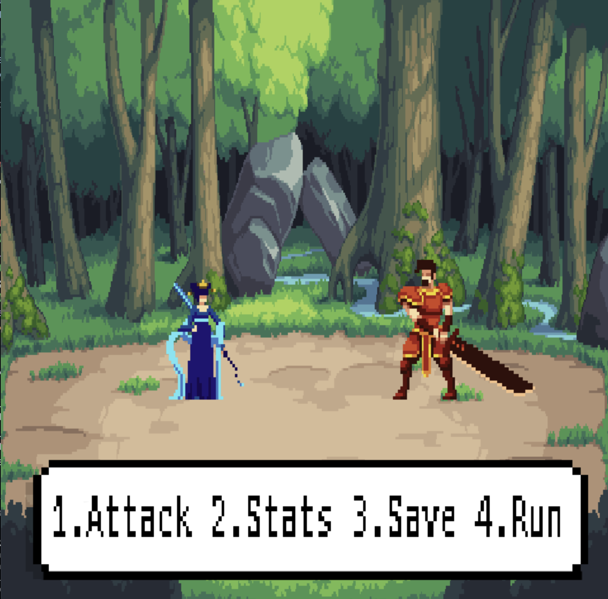

# Turn-Based RPG

A 2D, turn-based RPG developed in C++ using SDL2, featuring three unique characters and AI-powered enemy decision-making via OpenAI's GPT-3.5 Turbo.



## Table of Contents

- [Features](#features)
- [How to Play](#how-to-play)
  - [Characters](#characters)
  - [Gameplay](#gameplay)
- [Getting Started](#getting-started)
  - [Dependencies](#dependencies)
  - [Installation](#installation)
  - [Running the Game](#running-the-game)
- [Saving & Loading](#saving--loading)
- [Project Structure](#project-structure)
- [Acknowledgments](#acknowledgments)

## Features

- Play as Fire Knight, Ground Monk, or Water Priestess.
- Turn-based combat system.
- Enemy AI powered by GPT-3.5 Turbo (requires OpenAI API key).
- Save and load game progress using SQLite.
- Animated sprites and backgrounds.
- Text-based menus for actions and stats.

## How to Play

### Characters

| Fire Knight 🔥 | Water Priestess 🌊 | Ground Monk 🪨 |
|---------------|-------------------|---------------|
|  |  |  |

- **Fire Knight:** High damage, high energy cost, aggressive play.
- **Ground Monk:** Balanced stats, adaptable.
- **Water Priestess:** Lower damage, efficient energy usage, excels at sustained combat.

### Gameplay

- Choose your character and battle against an AI enemy.
- Each turn, select an action: Attack, Check Stats, Save, or Run.
- Attacks consume energy and deal damage; each character has four attack types.
- The battle ends when either character's health or energy reaches zero.

## Getting Started

### Dependencies

- SDL2
- SDL2_image
- SDL2_ttf
- nlohmann_json
- libcurl
- sqlite3

### Installation

1. Clone the repository:
    ```sh
    git clone https://github.com/ramirezfernando/turn-based-rpg.git
    ```
2. Install dependencies (macOS example using Homebrew):
    ```sh
    brew install sdl2 sdl2_image sdl2_ttf nlohmann_json sqlite3
    ```
3. Add your OpenAI API key to `api_key.txt` in the project root.

### Running the Game

1. Build and run:
    ```sh
    make game
    ```

## Saving & Loading

- The game automatically creates a SQLite database at `src/database/database.sqlite`.
- You can save your progress to one slot and load it from the main menu.

## Project Structure

```
assets/           # Game art assets (backgrounds, characters, text box)
images/           # Demo and roster images
src/
  background/     # Background rendering
  characters/     # Character classes and logic
  constants/      # Game and asset constants
  database/       # SQLite save/load logic
  text_box/       # Text box rendering and menu logic
  utils/          # Utility functions
  main.cpp        # Entry point
  game.cpp/.h     # Main game loop and logic
Makefile          # Build instructions
api_key.txt       # Your OpenAI API key (not tracked by git)
```

## Acknowledgments

Special thanks to:
- [Let's Make Games](https://www.youtube.com/watch?v=QQzAHcojEKg&list=PLhfAbcv9cehhkG7ZQK0nfIGJC_C-wSLrx)
- [Chierit](https://chierit.itch.io/)
- [Forest Background](https://pixeljoint.com/pixelart/120493.htm)

---